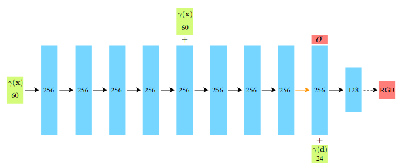

# DietNeRF: Putting NeRF on a Diet

## Summary of Our Attempt to Implement the Paper *(~15 Mins)*

---

This project is motivated by [HuggingFace X GoogleAI (JAX) Community Week Event 2021](https://discuss.huggingface.co/t/open-to-the-community-community-week-using-jax-flax-for-nlp-cv/7104) and we are pleased to announce that our project received the 2nd place in the event! This report aims to explain the model that we implemented and summarise how we trained it and what we found during the process.

In this project, we attempted to implement [DietNeRF](https://arxiv.org/abs/2104.00677), a variant of NeRF recently published in CVPR (Computer Vision and Pattern Recognition) 2021 conference. It is designed for few-shot learning of 3D scene reconstruction using 2D views. Below are some of the 3D scenes that our model managed to reconstruct (converted as an animated 2D rendered views):


We will break down our report into the following:

- [**👶 An Introduction to NeRF and DietNeRF**]()
- [**🧐 A Brief Look at the Dataset**]()
- [**🧪 Training Details**]()
- [**🤩 Experimental Results**]()
- [**✨ Demo Showcase**]()
- [**🔧 Challenges**]()
- [**👀 Future Work**]()
- [**🙌 Acknowledgements**]()
- [**🔊 Reach Out to Us!**]()
- [**🔖 References**]()

Additionally, you can view our project on below:

- 🎮 [GitHub Repo](https://github.com/codestella/putting-nerf-on-a-diet)
- ✨ [Hugging Face Spaces Demo](https://huggingface.co/spaces/flax-community/DietNerf-Demo)
- 🤗 [Hugging Face Model Repo](https://huggingface.co/flax-community/putting-nerf-on-a-diet)

## 👶 An Introduction to NeRF and DietNeRF

---

### What is NeRF Actually?

NeRF (Neural Radiance Field) is a deep-learning model for 3D scene reconstruction. The model has to learn to reconstruct a 3D scene based on samples of its 2D views. It is a simple MLP (Multi-layer Perceptron) network that learns a volumetric representation of a 3D scene. In a nutshell, this volumetric representation tells you the RGB colour and density (denoted as $\bold{c}$ and $\sigma$ respectively) for each point in the 3D scene (denoted as $\bold{x}$, or $x, y, z$) at different viewing directions (denoted as $\phi, \theta$).

Since the opacity of a point is the same no matter at which direction you view it (aka view independent), NeRF requires only spatial coordinate of the point $(x, y, z)$ as its input. On the other hand, the colour of a point changes at different viewing directions (aka view-dependent), so the network requires both spatial coordinate $(x, y, z)$ and viewing direction $(\phi, \theta)$ of a point as inputs to return its RGB colour $\bold{c}$. 



*From the figure, the model inputs are 24-dimensional and 60-dimensional vectors  because they have been transformed by **positional encoding** ($\gamma$). [This document](https://d2l.ai/chapter_attention-mechanisms/self-attention-and-positional-encoding.html) offers an excellent explanation for it.*

                    *Figure adopted from NeRF paper*


*Take ship scene from NeRF Synthetic dataset as an example, same point (highlighted by markers) can have different colours when it is viewed from different angles.*

*Figure adopted from NeRF paper*

### How Does NeRF Learn to Construct a 3D Scene?

NeRF can tell you the colour (view-dependent) and density (view-independent) of any point in the 3D scene at any viewing direction. But how are those 3D points translated into a 2D RGB view? By a classical trick called ***volumetric rendering***!

To simply walk through the technique, it starts off with a camera pose. Just think of camera pose as the position and direction that the viewer "**sees**" the scene. This is usually represented by a spatial coordinate with a direction. Next, we cast numerous rays through the 3D scene towards the camera pose. We mainly consider the rays that pass through the image to be rendered. The army of rays will resemble a shape of cone converging towards the camera pose. We then sample a dense grid of 3D samples along each ray. Usually the sampling takes place at a bounded interval in the 3D scene. Since each 3D sample carries both spatial coordinate and direction (i.e. pointing towards the camera pose), we can estimate its colour and density with NeRF. Finally, we can accumulate the estimates of all the samples along a ray to render a RGB pixel. 

The accumulation takes into account 3 factors:

- distance from the camera pose $T(t)$ (e.g. less weight assigned for point further apart)
- estimated colour of each 3D sample $\bold{c}$
- estimated density of every 3D sample $\sigma$

Therefore by considering a ray $\bold{r}$ (pointing towards direction $\bold{d}$) and the samples along the ray $\{\bold{r}(t_{i})\}^{N}_{i=1}$ , we can estimate the colour of a pixel where this ray marches through $\hat{C}(\bold{r})$ by the formula:

$\hat{C}(\bold{r}) = \frac{1}{N}\sum_{t} {T(t) \sigma(\bold{r}(t))\bold{c}(\bold{r}(t), \bold{d}) }$


      *Figure adopted from our experiments*

*This plot simulated a cone of light rays marching towards the coordinate of a camera pose (**black** point on the right hand side).* 

*Along each light ray, we randomly sample 3D samples within a bounded interval and then evaluate its estimated **colour** and **density** by NeRF. (density is visualised by transparency of the point)*

The same accumulation repeats pixel by pixel. Consequently, NeRF learns to render realistic view by gradually closing the difference between the RGB pixel it rendered $\hat{C(\bold{r}})$ and the RGB pixel from the ground-truth view $C(\bold{r})$. Such comparison is done on a batch of pixels by  Mean Squared Error  $L_{MSE}$:

$L_{MSE} = \sum_j \Vert \hat{C_{j}}(\bold{r})-C_{j}(\bold{r}) \Vert^2_2$

Since it is too expensive (in terms of time and memory) to render every RGB pixel, in practice only a set of randomly sampled pixels are evaluated:


*Figure adopted from [iNeRF Presentation](https://www.youtube.com/watch?v=eQuCZaQN0tI)*

**Due to limited space, a number of techniques utilised by NeRF are not covered here (e.g. positional encoding, hierarchical sampling, separation of coarse and fine networks). For more details about these techniques, you can refer to the [references]() at the end.*

### What Makes Vanilla NeRF Struggle?

It takes so much data to train NeRF to construct a scene. Usually it requires at least hundred of views and they have to capture diverse enough of views. It means that you have to shoot pictures for the same scene over and over again with all kinds of angles. As you could imagine, it is hardly practical in reality. 

NeRF struggles to construct a complete and high-quality scene with only a handful of views because the knowledge that it learned is so limited to the view poses that it is exposed to, and it fails to generalise on novel view poses. Such overfitting comes from the fact that NeRF lacks prior knowledge such as geometric properties. This leads to the degraded quality when rendering novel views from NeRF. 

Let's take a ship scene from NeRF Synthetic dataset as an illustration, below is an animated rendered views by NeRF trained on 14 views that are biased on one-sided. While NeRF managed to construct realistic views from the side that it is familiar, the novel views from another side looks blurry with a lot of artifacts.


*Animation rendered in one of our experiments*

### CLIP Comes Into Rescue!

CLIP (Contrastive Language-Image Pre-training) is a state-of-the-art network trained on a huge volume of image-text pairs scraped from the internet. It encapsulates rich set of visual and linguistic knowledge that are robustly transferable to many tasks, such as image recognition, question answering and image captioning. DietNeRF is the first work that utilises CLIP's prior knowledge on 2D images to help NeRF learn 3D scene reconstruction.

The intuition behind DietNeRF is driven by an intuitive observation, as quoted from the original paper:

> "**a bulldozer is a bulldozer from any perspective**": objects share high-level semantic properties between their views.

If NeRF is learning well on a 3D scene, then a view rendered by the model at a random pose should "**look**" semantically similar to any view from the training samples ( let's call them $\hat{I}$ and $I$ respectively ). Empirical study from the paper shows that CLIP's embedding ( let's call it $\phi$ ) is capable of capturing such semantic similarity, as shown below:


                      *Figure adopted from DietNeRF paper*

*This figure shows histogram of pair-wise cosine similarity scores of views embedded by CLIP. Score close to 1 indicates high degree of similarity.*

***red:** embedded views in the pair are from two different scenes.*

***green:** embedded views in the pair are from the same scene.*

To enforce such prior knowledge into NeRF's learning, the author coined ***Semantic Consistency Loss*** to be minimised in addition to the original reconstruction loss. It can be expressed as the cosine similarity between the embedded rendered view $\phi({\hat{I}})$ and the embedded ground truth view $\phi(I)$ with a hyper-parameter  $\lambda$:

$$\mathcal{L}_{sc}(I, \hat{I}) = -\lambda \phi(I)^T \phi(\hat{I})$$

**So in essence DietNeRF is simply a vanilla NeRF regularised by semantic consistency loss!**

## 🧐 A Brief Look at the Dataset

---

We used benchmark dataset — ***NeRF Synthetic*** in our experiments. It consists of different 3D scenes that are synthetically constructed:

- There are 8 scenes in total: **chair, drums, ficus, hotdog, lego, materials, mic, ship**
- Each scene consists of **100 Training images**, **100 Validation images**, **200 Test images**
- Each image has a resolution of **800 x 800**
- Each image is associated to a camera pose

### Chair


### Drums


### Ficus


### Hotdog


### Lego


### Materials


### Mic


### Ship


## 🧪 Training Details

---

Our implementation is written in JAX and Flax and is mainly based upon [jaxnerf](https://github.com/google-research/google-research/tree/master/jaxnerf) released by Google Research. The codebase is highly optimised for both TPU and GPU. We added semantic consistency loss into the base code and we utilised `FlaxCLIPModel` from [transformers](https://github.com/huggingface/transformers) library as our pre-trained CLIP Vision Transformer. 

We mainly ran experiments in ***GCP TPU v3-8**,* ***Colab Pro GPU-accelerated notebook and multi-GPUs server sponsored by [Common Computer AI](https://comcom.ai/en/#)***. We found that semantic consistency loss is particularly expensive to evaluate because it requires NeRF to render a complete view. The training takes ~15 hours to complete 200,000 iterations with ***Tesla P100***. You can find our implementation in our [🎮 GitHub Repo](https://github.com/codestella/putting-nerf-on-a-diet).

You can follow along the steps below with a copy of our [Colab notebook](https://colab.research.google.com/drive/1etYeMTntw5mh3FvJv4Ubb7XUoTtt5J9G?usp=sharing). (Running in Colab Pro is recommended to avoid out-of-memory exception)

### **How to train**

```bash
python -m train --data_dir={your/data/directory} --train_dir={path/to/log} --config=configs/{configurations}
```

Our configurations are stored in `configs`:

- DietNeRF trained in 4-shot: `diet_nerf_tpu_vm_4shot.yaml`
- DietNeRF trained in 8-shot: `diet_nerf_tpu_vm_few_shot.yaml`
- NeRF trained in 4-shot: `nerf_tpu_vm_4shot.yaml`
- NeRF trained in 8-shot: `nerf_tpu_vm_few_shot.yaml`

### **How to evaluate**

```bash
python -m eval --data_dir={your/data/directory} --train_dir={path/to/log} --config=configs/{configurations}
```

It will evaluate PSNR and SSIM (to be explained below) for all views from test set, and also output an animated rendering views by the model.

### Running Out of Memory?

We tested our code in ***Colab Pro GPU-accelerated notebook (Tesla P100/ V100).*** If you encounter out-of-memory exception during training, you could try the following tricks to reduce memory consumption (but note that it may slightly degrade the rendering quality):

- Reduce `batch_size`
- Reduce `num_fine_samples`
- Skip over volumetric rendering from fine network during semantic consistency loss
- Reduce crop size of the rendered view for semantic consistency loss

## 🤩 Experimental Results

---

### Metrics for Evaluating our Experiments

We used a number of metrics to measure model performances. ***PSNR*** and ***SSIM*** are part of them. Here we present a brief introduction to these two metrics and you could find its details in there attached in sub-pages.

**PSNR (Peak Signal-to-Noise Ratio)**

PSNR is a traditional quantity to measure the reconstruction quality of an image. Higher PSNR indicates better quality of an image. The measurement is similar to ***Mean Squared Error (MSE)*** mentioned before. 

It is a typical image quality assessment metric but its shortcoming is that it looks at each pixel independently which is not how we humans assess the quality of an image. In contrast, SSIM is a more contextual measure of image quality.

[Details about PSNR](https://www.notion.so/Details-about-PSNR-985de8ac8a294ab49d5a2168667c8a45)

**SSIM (Structural Similarity Index Measure)**

Unlike PSNR which looks at pixels individually, SSIM looks at a group of pixels when comparing two images which is how we humans assess the quality of an image. SSIM could associate image despite being distorted. (e.g. distorted by luminance or contrast)

[Details about SSIM](https://www.notion.so/Details-about-SSIM-1b37e53e4d864979ad7adcf36e9e1c4e)

Consider an image which is a copy of a reference image except it is shifted to right by 1 pixel. Since it is only shifted by an atomic step, we humans could hardy tell any perceptual  difference. 
But in this case PSNR may be significantly degraded because it treats the error of each pixel independently. SSIM, on the other hand, is insensitive to such shift in pixel and therefore its quantity tends to resemble human perception.

### 14-Shot Occluded Views

We followed a setting from the original paper: we trained DietNeRF with 14 views and they are all biased towards one side of the scene. And then we compared its rendering performance against NeRF.


*Sample views of training set in 14-shot Occluded setting for ship scene. Notice the views are biased towards one side of the ship.* 

We found that DietNeRF made a substantial visual difference! We show results from 2 scenes (**ship** and **lego**) as an illustration below: NeRF struggles to recover both coarse and fine texture on views from another side (unseen in training samples). Additionally, it is coupled with artifacts in the background. On the other hand, DietNeRF managed to preserve more details on those novel views with less artifacts. We conjecture the prior knowledge from CLIP is trying to fill up the "**gap**" for DietNeRF.

***DietNeRF trained on occluded 14-shot***


***NeRF trained on occluded 14-shot***


Besides qualitative analysis with the animated rendering quality, we also ran quantitative analysis on the quality of the rendered views. We measured PSNR (Peak Signal to Noise Ratio) and SSIM (Structural Similarity Index) for the rendered views. They are standard metrics for evaluating image quality. Image of high qualities will yield high value of both metrics. 

[PSNR Results for Occluded 14-shot](https://www.notion.so/c9e3b1f4e27644e58bd9da1d3611a5e4)

[SSIM Results for Occluded 14-shot](https://www.notion.so/14378fb6662c4b0eb246332bc64cc7ac)

> 📒 **NOTE:** Having said that DietNeRF is working well from the animation, the quantitative result is telling us an opposite story: DietNeRF received significantly lower PSNR and SSIM values than NeRF.
We conjecture it is caused by the inductive bias introduced by semantic consistency loss. It serves like a double-edged sword: while it helps DietNeRF recover the missing geometric structure for another side of the ship, it injects excessive bias on the colour of the ship body. As shown below, the ground truth colour of the ship body turns out to be black thanks to shadows. Such discrepancy in colours lead to a huge drop in both PSNR and SSIM.


*The ground truth views of another side of the ship. This side is not seen by both DietNeRF and NeRF in training during 14-shot occluded setting. The ship body tends to look black due to shadows.*

### 8-Shot Views

We then experimented with another setting adopted from the original paper: we trained both DietNeRF and NeRF with 8 views. 
From the animations below, DietNeRF in general renders views with less artifacts in the background. It tends to preserve finer texture than NeRF in most angles. In addition, it consistently yield a better PSNR and SSIM for most scenes.

***DietNeRF trained on 8-shot***


***NeRF trained on 8-shot***


[PSNR Results for 8-shot](https://www.notion.so/ac9505eabcea4cf39caabd59b0178a32)

[SSIM Results for 8-shot](https://www.notion.so/2725d1f09a4e4eb085ccd5be79c2c784)

### 4-Shot Views

We wanted to challenge the limit of DietNeRF so we attempted to train a few scenes with only 4 training samples. This is a setting not covered in the original paper. We found that it is an extremely challenging task for both DietNeRF and NeRF. 

While DietNeRF outperforms NeRF by rendering less artifacts in the background and preserving more textures in some scenes, such as the following:

***DietNeRF trained on 4-shot***


***NeRF trained on 4-shot***


In some other scenes, both DietNeRF and NeRF fails to learn both geometrical properties and texture of the scenes. The rendering views look completely off. Here is an example of the failures we experienced:

***DietNeRF trained on 4-shot***


***NeRF trained on 4-shot***


[PSNR Results for 4-shot](https://www.notion.so/72f7a467b1694cb2a4f0c01d6ff20858)

[SSIM Results for 4-shot](https://www.notion.so/c551cfaf34fc4a4bb62a6f750345f947)

Later we found out that the random seed for sampling views greatly affects the final rendering quality. The rendering quality of microphone got significantly better with another random seed. We conjecture the choice of random seed when selecting 4-shot views could significantly shake up the model performance. If your seed ends up with 4 views from the same side, it is so challenging for a model (even for DietNeRF) to generalize well.

## ✨ Demo Showcase

---
We demonstrate our trained models in a Streamlit interface. It is hosted in Space, a beta platform recently launched by Hugging Face. 

In the interface, we provide models of different 3D scenes for users to play around. Once a model is selected, users can freely query views of the 3D scene from our trained model. They can control the viewing pose by the 3 parameters (`theta`, `phi`, `radius`) that we offer. `theta` determines the horizontal angle of your pose (e.g. left to right), while `phi` determines the vertical angle (i.e. top down). Lasty `radius` controls the distance from the scene for your viewing pose.

[insert demo screenshot]  
[attach link to the demo when the bug is fixed]

As explained before, rendering a complete view from a NeRF model is computationally intensive. To make view rendering under tolerable latency, we apply down-sampling on the view to be rendered. With GPU support (special thanks to Hugging Face team for the kind offer!), it took less than 10 seconds to render a view. 

## 🔧 Challenges

---

Reproducing the implementation and the results from the paper is one of our major challenges because there is no source code we could take reference from.

Running out-of-memory is one of the blockers during our implementation. The paper mentioned some tricks to reduce memory consumption, such as mixed precision, rendering down-sampled image, removing intermediate activation when evaluating semantic consistency loss. 

Due to time constraint and our insufficient knowledge in JAX/ Flax, we didn't fully follow the tricks. As a starter, we applied a big factor of down-sampling on views that we render for semantic consistency loss. This strategy managed to get our training to work in Colab Pro notebook. We believe high resolution of rendered views could improve the signal propagated by the loss, so we explored different tricks to progressively reduce the down-sampling factor . We tried mixed precision. We tried rendering a random crop of an image to save memory. We tried using only fine network/ coarse network during semantic consistency loss. Despite all the tricks we tried so far, we couldn't consistently reproduce the rendering quality and quantitative results shown in the paper — our tricks work well in particular scenes but not the others. 

Meanwhile, we found the rendering quality by the NeRF models that we trained is not as bad as it is shown in the paper. While the paper showed NeRF significantly struggles to construct novel views and its PSNR and SSIM is generally low across scenes, we found that with enough iterations NeRF is capable of constructing at least a very coarse texture of the object from novel views. Also we found its PSNR and SSIM are higher than stated in the paper. We could not find out the reason so far. We suspect this is because of some implementation differences in our base code jaxnerf.

Here we supplement a figure adopted from DietNeRF paper. It compares rendering quality by different variants of NeRF for both novel and observed views.


## 👀 Future Work

---

### Optimizing Training Loop

Even though jaxnerf is by itself highly optimized in speed, plugging in semantic consistency loss costs ~15 hours to train 200,000 iterations with Tesla P100. Also, the loss requires a lot of memory because it requires the model to render a whole image. Such memory constraint makes DietNeRF hard to train in a single GPU. We adopted a number of tricks as a walkaround (such as rendering down-sampled image, mixed precision ... etc.)  but they inevitably sacrifice the quality of the signal carried by semantic consistency loss. Making the training of DietNeRF accessible to consumer-level GPU at reasonable speed with minimal  impact on signal propagated by semantic consistency loss would be one of the possible improvement in the future.

### Complete Benchmarking and Ablation Studies

Due to time limit, we only select a few scenes to train on 14-shot occluded, 8-shot and 4-shot settings. While DietNeRF outperform NeRF in most scenes we selected in 8-shot setting, we didn't notice the same trend in other settings. In addition, we couldn't reproduce the quantitative results reported in the original paper.

While the visual quality rendered by DietNeRF looks astonishing in some scenes, we would take the results with a pinch of salt. Before we can draw a convincing conclusion on the capacity of DietNeRF and its comparison against NeRF, we need a complete benchmark across all scenes and investigate the discrepancy between our experimental results and the one reported in the original paper.

### Experimenting on More Benchmark Datasets

We only managed to experiment our DietNeRF on NeRF Synthetic dataset. Since the scenes in the dataset are synthetic so it could not reflect DietNeRF's capacity on realistic scenes. It will be interesting to experiment DietNeRF on benchmarks datasets that are based upon realistic scenes, such as [Local Light Field Fusion](https://bmild.github.io/llff/), [Photo Tourism](http://phototour.cs.washington.edu/).

### Some More Ideas!

The original paper states you can render quality scene with even ***ONE SINGLE*** view using PixelNeRF (another variant of NeRF specializing in few shot learning) plus semantic consistency loss. Meanwhile, another work shows NeRF can learn way faster and adopt prior knowledge about the scene by a careful weight initialization using meta-learning. 

Those are the exciting ideas worthwhile to be explored in the future. We would love to see how far NeRF can go in few-show learning! 🤩

## 🙌 Acknowledgements

---

We sincerely thank ***[Hugging Face](https://huggingface.co/)*** for organising this event, Google's Cloud team for providing every team with free access to ***GCP's TPU v3-8***, and Google's Flax and JAX team for organising introductory talks to JAX and Flax and providing technical advice on the domain. Special shout out to [***Patrick***](https://twitter.com/PatrickPlaten) and [***Suraj***](https://twitter.com/psuraj28) for their tremendous efforts to maintain the event and help address the technical issues from every team!


Finally, we would like to thank [***Common Computer AI***](https://comcom.ai/) for granting our team free access to its multi-GPUs (Tesla V100) server.


## 🔊 Reach Out to Us!

In retrospect, our team gained a lot throughout the journey and we would love to keep improving this project. We are welcome to any feedback and contributions! Feel free to reach out to our core contributors (listed in alphabetical order):

- 🇭🇰 [Alex Lau](https://twitter.com/AlexLau314)
- 🇮🇳 [Haswanth Aekula](https://twitter.com/hassiahk)
- 🇰🇷 [Seoyeon Stella Yang (Project Organizer)](https://twitter.com/codestella?lang=en)
- 🇰🇷 [Seunghyun Lee](https://github.com/sseung0703)

## 🔖 References

---

1. [Putting NeRF on a Diet: Semantically Consistent Few-Shot View Synthesis](https://arxiv.org/abs/2104.00677)
2. [NeRF: Representing Scenes as Neural Radiance Fields for View Synthesis](https://arxiv.org/abs/2003.08934)
3. [Learned Initializations for Optimizing Coordinate-Based Neural Representations](https://www.matthewtancik.com/learnit)
4. [Dive Into Deep Learning: 10.6. Self-Attention and Positional Encoding](https://d2l.ai/chapter_attention-mechanisms/self-attention-and-positional-encoding.html)
5. [Yannic Kilcher: NeRF: Representing Scenes as Neural Radiance Fields for View Synthesis (ML Research Paper Explained)](https://www.youtube.com/watch?v=CRlN-cYFxTk)
6. [Transformers: FlaxCLIPModel Documentation](https://huggingface.co/transformers/model_doc/clip.html#flaxclipmodel)
7. [jaxnerf2020 Github Repo](https://github.com/google-research/google-research/tree/master/jaxnerf)